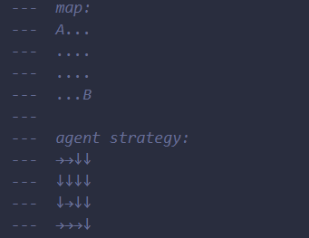
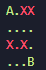

# Maude for DRL

本项目旨在使用Maude对DRL训练出的智能体模型进行形式化验证。
## 目录

- [如何使用](#如何使用)
- [项目完整流程](#项目完整流程)
- [项目文件结构](#项目结构)

## 如何使用

环境要求：建议使用Linux系统

**Python** 3.8版本可正常使用

运行`pip install -r requirements.txt`安装依赖

**Maude**  需要在本地安装Maude，并找到`model-checker.maude`文件的路径（后续会用到）

运行步骤：

1. 在`maude_files`文件夹中选择一个Maude文件，复制路径，例如：`maude_files/4x4/1.maude`，意味着这个Maude文件是对4x4地图的某个智能体策略建模的代码；
2. 随后找到本地`model-checker.maude`和Maude程序的路径，运行下列指令即可查看结果，结果有两个部分，包括终端直接输出的可视化结果（参考本文档末尾的图片）以及`out.txt`文件，里面包含Maude验证的详细结果：
```bash
./eval.sh maude_files/4x4/1.maude /path/to/model-checker.maude /path/to/maude
```

注：`maude_files/4x4/1.maude`（和`maude_files`目录下其他文件一样）包含了地图和智能体策略的完整信息，可与验证结果结合查看。
例如：

<div align="center">

</div>

## 项目完整流程

1. 使用DRL方法（这里不局限于DQN，任意算法都可）训练智能体，将策略保存在`map`文件夹下的对应地图文件夹中，参考：`map/8x8/0/1/actions.txt`；
2. 选中某个训练得到的智能体数据路径，运行generate_maude.py，例如：`map/4x4/0.3/6`，会在`maude_files/4x4`下生成对应的Maude建模代码，其中的迁移规则和智能体的策略一致；
3. 运行eval.sh，提供上一步生成的Maude代码路径，例如：`maude_files/4x4/1.maude`，提供本地`model-checker.maude`文件路径以及Maude程序的路径，最终会在`evaluate.maude`中生成对应的评估代码，并执行代码，结果保存在`out.txt`文件中，同时在终端展示可视化结果,如下图，绿色的点表示从该点出发可以到达终点（B），红色的点则代表不能到达终点，其中X表示陷阱，陷阱都显示为红色；

<div align="center">

</div>

## 项目结构

```txt
.
├── README.md
├── analyse.py # 分析Maude验证的结果，可视化效果
├── demo.maude # Maude对智能体策略建模的示例
├── drl        # 使用DRL方法训练智能体
│   ├── DQN.py # DQN算法
│   ├── Environment.py # 环境类
│   └── train.py # 训练脚本
├── eval.sh    # 自动评估脚本
├── evaluate.maude # 自动生成的用来评估的Maude代码
├── gen_eval.py    # 生成evaluate.maude的脚本
├── generate_maude.py # 根据智能体策略生成Maude建模代码的自动脚本
├── map                             # 地图文件 以及 智能体策略
│   ├── 3x3                         # 表示是3x3的地图
│   │   ├── 0                       # 0 表示这个地图中陷阱所占比例
│   │   │   ├── 5                   # 存储某次训练的结果（包括智能体的所有数据，策略等）
│   │   │   │   ├── action.txt      # 智能体策略
│   │   │   │   ├── parameters.json # 训练智能体时用的参数
│   │   │   │   ├── q_net.pth       # 保存的智能体模型参数
│   │   │   │   └── return.png      # 训练过程中的reward曲线
│   │   │   ├── config.pkl          # 地图的配置文件
│   │   │   ├── grid.npy            # 存储陷阱的位置信息
│   │   │   └── grid.txt            # 地图的文本表示
│   │   └── ...
│   ├── 4x4
│   │   ├── ...
│   ├── 6x6
│   │   ├── ...
│   └── 8x8
│       └── ...
├── maude_files                     # 存储Maude建模代码
│   ├── 4x4                         # 4x4地图内的代码
│   │   ├── 1.maude                 # 编号无意义，为对某个智能体策略建模的代码
│   ├── 6x6
│   │   └── ...
│   └── 8x8
│       └── ...
└── out.txt                         # Maude验证结果的输出
```